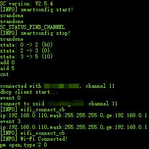

# smartconfig_wifi_app

上电后先使用smartconfig进行配网，一段时候后没有收到配网消息则尝试连接上次成功的Wi-Fi。

工程设置了GPIO0为Wi-Fi状态灯。进入smartconfig模式的`SC_STATUS_FIND_CHANNEL`状态后，状态灯会每隔1秒闪烁一次；当退出smartconfig，Wi-Fi连接失败则会快速闪烁，Wi-Fi连接成功则保持常亮（输出低电平）。

当然也可以启用`WIFI_SSID_ENABLE`，直接使用写死在代码的`WIFI_SSID`和`WIFI_PASS`进行连接。

# 配置

在`include/wifi_connfig.h`文件可以进行自定义配置：

```C
//***********************************************************************/
// 使用下面的wifi配置进行连接
// 与下面的 SMARTCONFIG_ENABLE 二选一
//#define WIFI_SSID_ENABLE

#define WIFI_SSID "wifi_ssid"
#define WIFI_PASS "wifi_pass"

//***********************************************************************/
// 上电时使用smartconfig进行wifi配置
#define SMARTCONFIG_ENABLE

/* wifi led 引脚配置 */
#define WIFI_STATUS_LED_PIN         0

//***********************************************************************/
```

# 效果图



# 移植说明

只需要拷贝以下文件即可简单移植到新工程：

- 有关wifi的源码：`user/user_wifi.c`+`include/user_wifi.h`
- 有关smartconfig的源码：`user/user_smartconfig.c`+`include/user_smartconfig.h`
- wifi配置文件：`include/wifi_connfig.h`


之后只需在`user_main.c`中这样调用即可：

```C
#include "user_wifi.h"

// ...

void ICACHE_FLASH_ATTR
init_done_cb_init(void) {
    // ...
    wifi_set_opmode(STATION_MODE);  // set wifi mode
    wifi_connect();
}

void ICACHE_FLASH_ATTR
user_init(void) {
    // uart_init(BIT_RATE_115200, BIT_RATE_115200);
    system_init_done_cb(init_done_cb_init);
}

```
